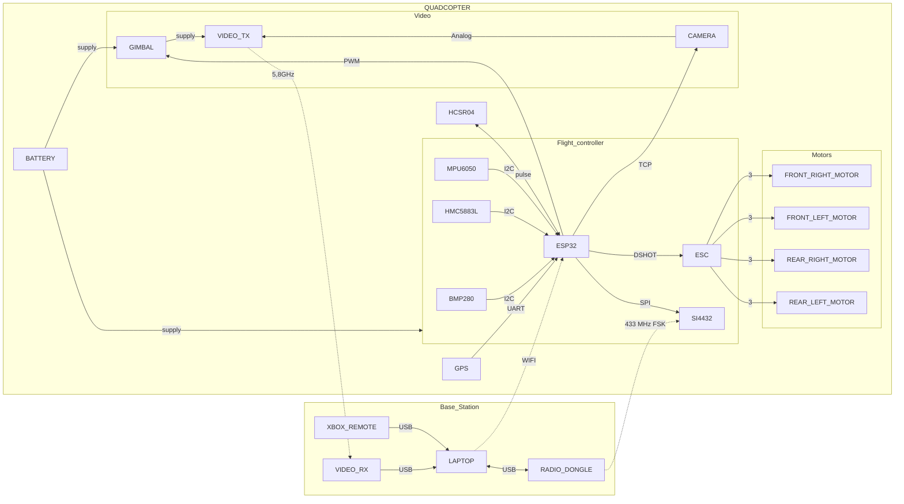
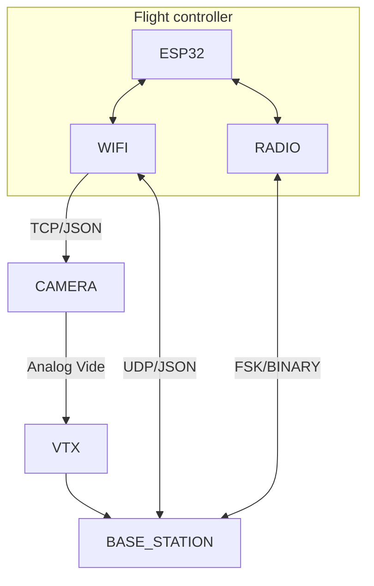

# Quadcopter

DIY quadcopter based on ESP32-WROOM

## Overview

### Architecture overview

### Sensors

* Attitude sensing is based on MPU6050 (accelerometer + gyroscope) and HMC5883L (magnetometer), computed through a [Madgwick Filter](https://x-io.co.uk/open-source-imu-and-ahrs-algorithms/)
* Height sensing is based on vertical linear acceleration (output of attitude filter), a BMP180 (barometer) and a HCSR04 (ultrasound range sensor), computed through a [Kalman filter](https://en.wikipedia.org/wiki/Kalman_filter)
* Position sensing is base on horizontal linear acceleration (output of attitude filter) and a GPS, computed through a Kalman filter [Kalman filter](https://en.wikipedia.org/wiki/Kalman_filter)

cf. [documents](https://github.com/arnaudhe/quadcopter/tree/master/documents) for more details

### Controllers

* Attitude controller (manual mode) is based on a 4-dimensions [PID](https://en.wikipedia.org/wiki/PID_controller) (roll, pitch, yaw, height)
* Position controller (autonomous mode) is based on a 3-dimensions [PID](https://en.wikipedia.org/wiki/PID_controller) (x, y, z) which drives attitude controller

BLDC motors control is based on a commercial 4-in-1 ESC (electronic speed controller)

cf. [documents](https://github.com/arnaudhe/quadcopter/tree/master/documents) for more details

### Camera

The quadcopter is designed to support a [YI action camera](https://www.yitechnology.com/yi-action-camera), hold on a [2D Gimbal](https://hobbyking.com/fr_fr/tarot-t-2d-v2-xiaomi-yi-sports-camera-brushless-camera-gimbal-and-zyx22-controller.html).

The camera has:
* A TCP interface which supports json commands (take a picture, start recording, list files, ...)
* A streaming RTSP server which can be used for live video preview

The gimbal angles can be driven by the ESP32 through a serial interface.

### Communication

Communication between base station (computer or remote) is based on a shared data model, definied in a json file.

The data model ressources are implemented by the quadcopter and can be read/written/notified via:
* a json protocol (better for debug, high bandwith medium)
* a binary protocol (better for release, low bandwidth medium)

Two communications media are supported by the quadcopter:
* wifi (low range, hight bandwidth)
* FSK (longer range, low bandwidth)

